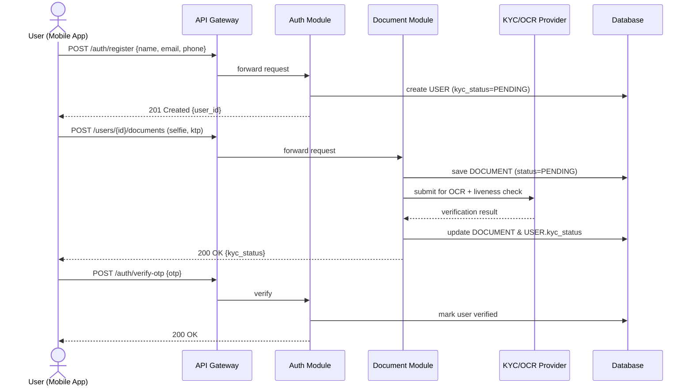
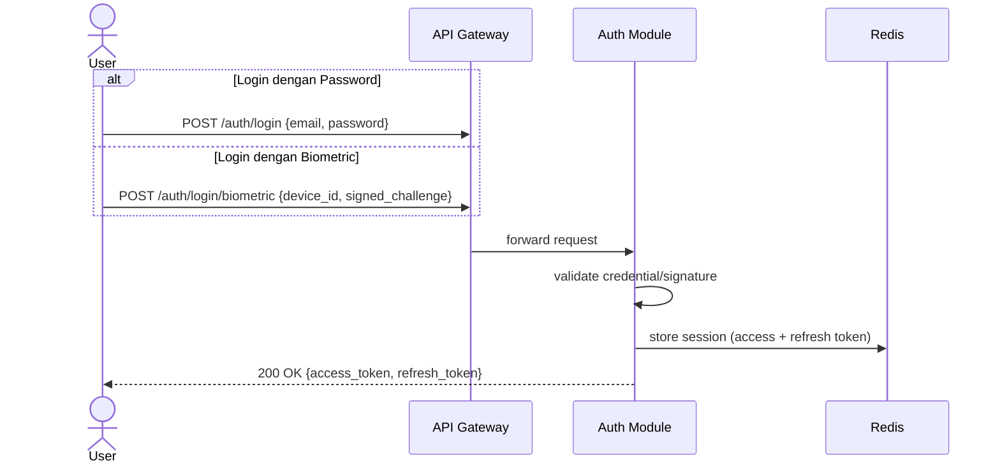
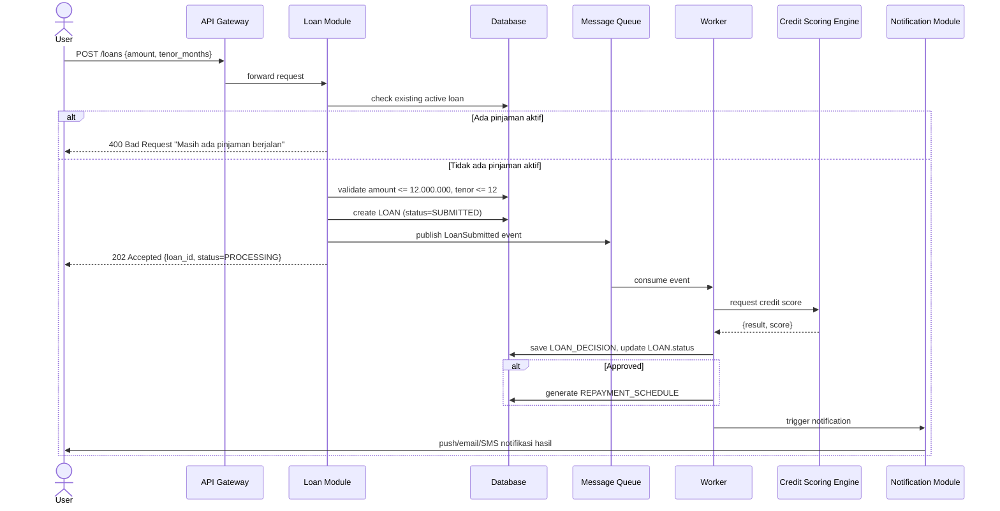
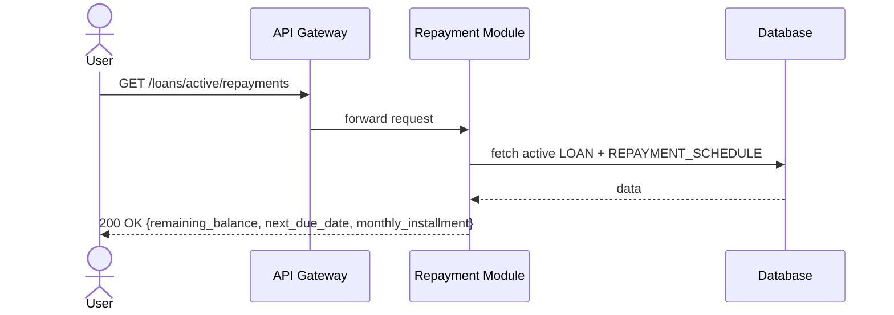

# API Sequence Diagrams

## 1. Registrasi + Upload KTP + KYC

```mermaid
sequenceDiagram
    actor U as User (Mobile App)
    participant GW as API Gateway
    participant Auth as Auth Module
    participant Doc as Document Module
    participant KYC as KYC/OCR Provider
    participant DB as Database

    U->>GW: POST /auth/register {name, email, phone}
    GW->>Auth: forward request
    Auth->>DB: create USER (kyc_status=PENDING)
    Auth-->>U: 201 Created {user_id}

    U->>GW: POST /users/{id}/documents (selfie, ktp)
    GW->>Doc: forward request
    Doc->>DB: save DOCUMENT (status=PENDING)
    Doc->>KYC: submit for OCR + liveness check
    KYC-->>Doc: verification result
    Doc->>DB: update DOCUMENT & USER.kyc_status
    Doc-->>U: 200 OK {kyc_status}

    U->>GW: POST /auth/verify-otp {otp}
    GW->>Auth: verify
    Auth->>DB: mark user verified
    Auth-->>U: 200 OK
```

## 2. Login (Password / Biometric)

```mermaid
sequenceDiagram
    actor U as User
    participant GW as API Gateway
    participant Auth as Auth Module
    participant Cache as Redis

    alt Login dengan Password
        U->>GW: POST /auth/login {email, password}
    else Login dengan Biometric
        U->>GW: POST /auth/login/biometric {device_id, signed_challenge}
    end
    GW->>Auth: forward request
    Auth->>Auth: validate credential/signature
    Auth->>Cache: store session (access + refresh token)
    Auth-->>U: 200 OK {access_token, refresh_token}
```

## 3. Pengajuan Pinjaman (Apply Loan)

```mermaid
sequenceDiagram
    actor U as User
    participant GW as API Gateway
    participant Loan as Loan Module
    participant DB as Database
    participant Q as Message Queue
    participant W as Worker
    participant Score as Credit Scoring Engine
    participant Notif as Notification Module

    U->>GW: POST /loans {amount, tenor_months}
    GW->>Loan: forward request
    Loan->>DB: check existing active loan
    alt Ada pinjaman aktif
        Loan-->>U: 400 Bad Request "Masih ada pinjaman berjalan"
    else Tidak ada pinjaman aktif
        Loan->>DB: validate amount <= 12.000.000, tenor <= 12
        Loan->>DB: create LOAN (status=SUBMITTED)
        Loan->>Q: publish LoanSubmitted event
        Loan-->>U: 202 Accepted {loan_id, status=PROCESSING}

        Q->>W: consume event
        W->>Score: request credit score
        Score-->>W: {result, score}
        W->>DB: save LOAN_DECISION, update LOAN.status
        alt Approved
            W->>DB: generate REPAYMENT_SCHEDULE
        end
        W->>Notif: trigger notification
        Notif->>U: push/email/SMS notifikasi hasil
    end
```

## 4. Lihat Sisa Hutang & Tagihan

```mermaid
sequenceDiagram
    actor U as User
    participant GW as API Gateway
    participant Repay as Repayment Module
    participant DB as Database

    U->>GW: GET /loans/active/repayments
    GW->>Repay: forward request
    Repay->>DB: fetch active LOAN + REPAYMENT_SCHEDULE
    DB-->>Repay: data
    Repay-->>U: 200 OK {remaining_balance, next_due_date, monthly_installment}
```
